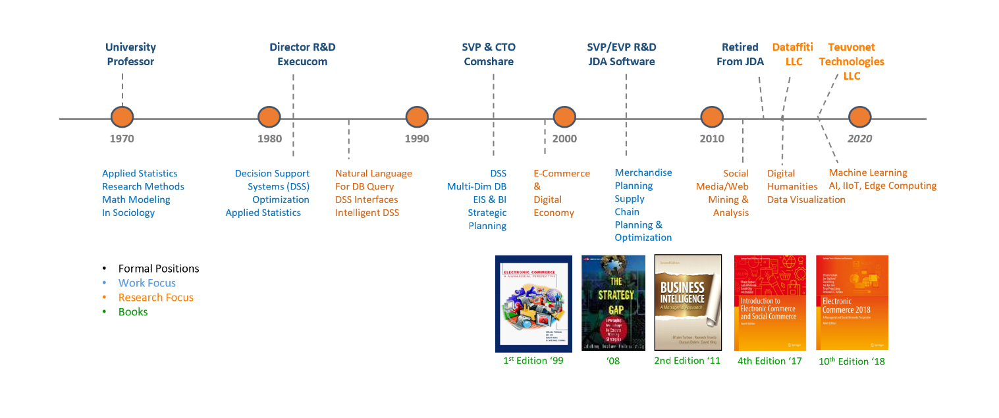

# Bio-and-Resume

In my early years, I was formally trained as a social scientist, mathematical sociologist, and statistician and applied this training both in academics and the commercial software industry for 45 years (for an overview see the diagram below, for the details see my <a href='https://github.com/daveking63/Bio-and-Resume/blob/master/David%20King%20Resume%20-%202018.pdf'>resume</a>. Over those 45 years I picked up specialized knowledge in databases (SQL and NoSQL), natural language processing, AI, machine learning and data mining, image processing, data visualization, infographics, and a very long laundry list of computer programming languages (65+ at last count). 

At the end of 2014, I officially retired.  Since my retirement, I have devoted much of my time to various research projects focused on applying this specialized knowledge to the data and visual mining of social media of various sorts and to the areas of algorithmic and generative art. Towards this end, I formed an LLC called *Dataffiti* devoted to these research endeavors. For a description of many of the projects I have undertaken, see the other repositories at <a href='https://github.com/daveking63'>my github site</a>.

More recently, I've also been serving as an Advisor/Board Member to a startup company called *Teuvonet Technologies LLC*. Teuvonet is focused on the development of artificial intelligence and machine learning chips and SOCs for real-time analysis of data from sensory devices with the goal of detecting anomalies, failures, and providing emergency service or predictive preventative maintenance.

**Career Overview**

**Some Career Highlights:**
<ul>
<li>Ph.D. from the University of North Carolina Chapel Hill in Sociology with a minor in Mathematical Statistics. 10+ years teaching applied statistics, research methods and math modeling at the undergraduate and graduate levels.</li>
<li>30+ years leading and managing the design, development and delivery of commercial, enterprise planning and analytical software for three independent software vendors (ISVs). The software was used by 1000’s of customers to help run some of the largest retail, manufacturing, transportation and distribution businesses in the world (including 70 of the global 100).</li>
<li>At <a href='http://jda.com'>JDA Software</a> helped lead the acquisition and merger of 3 major supply chain software companies, taking the company from $200M to $1B in revenues and from 500 to 4500 employees.</li>
<li>At <a href='http://jda.com'>JDA Software</a> helped establish and lead the development of the JDA Center of Excellence in India, growing the operation from ~150 developers to ~2000 employees working in development, consulting and support with annual turnover of 5-10%.</li>
<li>In 1997 introduced the Internet and Digital Economy Track at HICSS. It is still in operation, although I stepped down as the co-chair in 2018 (see <a href='https://scholarspace.manoa.hawaii.edu/handle/10125/52003'>Index to IEEE HICSS Proceedings</a>).</li>
<li> In 1999 co-authored a leading textbook in E-Commerce.  The 9th edition of <a href='https://www.springer.com/us/book/9783319587141'><i>E-Commerce 2018:A Managerial and Social Networks Perspective</i></a> was released in 2018. Additionally, in 2003 published an <a href='https://www.springer.com/us/book/9783319500904'><i>Introduction to Electronic Commerce</i></a>. The 4th edition of the Introduction was released in 2017.</li>
<li>From 2010-2015 developed and delivered a series of tutorials on Web and Social Media Mining and Visualization (copies in PDF format are available at this site, see https://github.com/daveking63/Rudiments-of-Social-Network-Analysis/tree/master/SNA-Tutorials).</li>
</ul>
